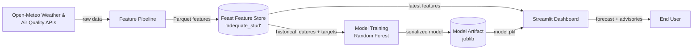

#  10Pearls AQI Predictor

**Machine learning system forecasting Lahore's Air Quality Index (AQI) 72 hours ahead**

*Built during the 10Pearls Internship Program*

---

## 📋 Table of Contents

- [Overview](#-overview)
- [Key Features](#-key-features)
- [System Architecture](#-system-architecture)
- [Tech Stack & Alternative Tool Choices](#-tech-stack--alternative-tool-choices)
- [Repository Structure](#-repository-structure)
- [Feature Store (Feast) Configuration](#-feature-store-feast-configuration)
- [Getting Started](#-getting-started)
- [Model & Evaluation](#-model--evaluation)
- [AQI Reference Scale](#-aqi-reference-scale)
- [Roadmap & Known Limitations](#-roadmap--known-limitations)
- [Contributing](#-contributing)
- [License](#-license)
- [Author](#-author)

---

## 🔎 Overview

**10Pearls AQI Predictor** is an end-to-end forecasting system that predicts fine particulate matter (PM2.5) and the corresponding Air Quality Index for **Lahore, Pakistan**, up to **72 hours in advance**. It implements the full MLOps lifecycle — automated feature engineering, a versioned feature store, model training and evaluation, and an interactive Streamlit dashboard — on a serverless-friendly, cost-free stack.

Where the original project brief suggested specific example tools, this implementation deliberately substitutes several of them with open-source, self-hostable alternatives — most notably **Feast** in place of Hopsworks/Vertex AI, and **Open-Meteo** in place of AQICN/OpenWeather (see [Tech Stack & Alternative Tool Choices](#-tech-stack--alternative-tool-choices) for the rationale).

---

## ✨ Key Features

| Capability | Description |
|---|---|
| 🔮 **72-hour forecast** | Hourly or Day 1 / Day 2 / Day 3 summary views |
| 🩺 **EPA-standard AQI conversion** | PM2.5 → AQI mapped via official US EPA breakpoints |
| 🚦 **Health advisories** | Outdoor activity and indoor precaution guidance that adapts to the live predicted AQI |
| 📈 **Model diagnostics** | MAE, RMSE, R², and feature-importance visualization for interpretability |
| 📥 **Data export** | One-click CSV download of the full 72-hour forecast |
| 🗄️ **Feast feature store** | Versioned entities and feature views shared between training and inference |
| ⚙️ **Automation-ready** | GitHub Actions workflows for pipeline orchestration |

---

## 🏗️ System Architecture



**Pipeline stages:**

1. **Feature Pipeline** — fetches weather and pollutant data from Open-Meteo and computes:
   - *Temporal features:* hour, day, day of week, month, year, is-weekend
   - *Weather features:* temperature, relative humidity, precipitation, surface pressure, wind speed & direction
   - *Pollutant features:* PM10, PM2.5, CO, NO₂, SO₂, ozone, dust
2. **Feast Feature Store** — registers and serves these features (offline for training, online-capable for low-latency serving)
3. **Model Training** — trains and evaluates a Random Forest Regressor against MAE, RMSE, and R²
4. **Dashboard** (`app.py`) — loads the trained model and latest predictions, converts PM2.5 to AQI via EPA breakpoints, and renders forecasts, advisories, and diagnostics

---

## 🛠️ Tech Stack & Alternative Tool Choices

The project brief suggested example tools for each pipeline stage while explicitly encouraging alternatives. Here's what was actually used and why:

| Pipeline Stage | Brief Suggested | Actually Used | Why |
|---|---|---|---|
| Raw data source | AQICN or OpenWeather | **Open-Meteo** (Weather + Air Quality API) | Free, keyless, high rate limits, with both historical and forecast endpoints — no API key provisioning for a fully serverless pipeline. |
| Feature store | Hopsworks or Vertex AI | **Feast** (open-source) | Self-hostable with no account/quota constraints; integrates natively with Python and Parquet offline storage, while still providing entities, feature views, TTL, and online/offline serving. |
| Model registry | *(implied managed registry)* | **Local joblib-serialized model** | Avoids requiring a separate managed service, consistent with the zero-cost, serverless design goal. |
| Model training | scikit-learn or TensorFlow/PyTorch | **scikit-learn — Random Forest Regressor** | Strong baseline on mixed-type tabular environmental data without deep learning's tuning/infrastructure overhead. |
| CI/CD | Apache Airflow or GitHub Actions | **GitHub Actions** | Runs natively alongside the repo — no separate infrastructure to provision. |
| Web app | Streamlit/Gradio or Flask/FastAPI | **Streamlit** | Fastest path to an interactive, chart-rich dashboard directly in Python. |

### Full Stack

| Layer | Technology |
|---|---|
| Language | Python 3.11+ |
| Data source | Open-Meteo Weather API & Air Quality API |
| Feature store | Feast |
| Data processing | pandas, NumPy |
| ML / Modeling | scikit-learn (Random Forest Regressor) |
| Model serialization | joblib |
| Visualization | Plotly, Matplotlib, Seaborn |
| Dashboard | Streamlit |
| Automation | GitHub Actions |

---

## 📂 Repository Structure

```text
10pearls-AQI-Predictor/
├── .github/workflows/        # GitHub Actions workflows (pipeline automation)
├── assets/                   # Static assets used by the project/dashboard
├── data/                     # Raw/processed data, including lahore_features.parquet
├── feature_store/
│   └── adequate_stud/        # Feast feature repository
├── results/
│   ├── predictions/          # Forecast output (latest_72_hour_prediction.csv)
│   └── models/               # Evaluation output (test_performance.csv)
├── src/                      # Data fetching, feature engineering, training scripts
├── app.py                    # Streamlit dashboard (entry point)
├── feature_definitions.py    # Feast entity, data source, and feature view definitions
├── requirements.txt          # Python dependencies
└── .gitignore
```

> **Note:** `models/` (containing the serialized model, e.g. `random_forest_72h.pkl`) is not committed — it's generated by the training pipeline. Run training before first launch, or the dashboard falls back to a synthetic demo forecast.

---

## 🗄️ Feature Store (Feast) Configuration

Feature definitions live in `feature_definitions.py`:

| Component | Value |
|---|---|
| Feast project name | `adequate_stud` *(Feast's auto-generated project name)* |
| Entity | `aqi_location` (join key: `location_id`) |
| Data source | `FileSource` → `data/lahore_features.parquet` |
| Timestamp field | `event_timestamp` |
| Feature view | `lahore_air_quality_features` |
| TTL | 7 days |
| Online serving | Enabled |

**Feature schema:**
- **Weather:** `temperature_2m`, `relative_humidity_2m`, `precipitation`, `surface_pressure`, `wind_speed_10m`, `wind_direction_10m`
- **Air quality:** `pm10`, `pm2_5`, `carbon_monoxide`, `nitrogen_dioxide`, `sulphur_dioxide`, `ozone`, `dust`
- **Time:** `hour`, `day`, `day_of_week`, `month`, `year`, `is_weekend`

---

## 🚀 Getting Started

### Prerequisites
- Python 3.11+
- Git

### 1. Clone the repository
```bash
git clone https://github.com/inaam78/10pearls-AQI-Predictor.git
cd 10pearls-AQI-Predictor
```

### 2. Set up a virtual environment (recommended)
```bash
python -m venv venv
source venv/bin/activate      # Windows: venv\Scripts\activate
```

### 3. Install dependencies
```bash
python -m pip install --upgrade pip
pip install -r requirements.txt
pip install streamlit plotly feast
```

### 4. Generate features, train the model, and populate results
Run the pipeline scripts under `src/` to populate the Feast feature store, `models/`, and `results/` before first launch.

### 5. Launch the dashboard
```bash
streamlit run app.py
```
Open the local URL Streamlit prints (typically `http://localhost:8501`).

---

## 📊 Model & Evaluation

Baseline performance for the current model (72-hour horizon):

| Metric | Value |
|---|---|
| **MAE**  | 28.56 µg/m³ |
| **RMSE** | 40.54 µg/m³ |
| **R²**   | 0.4681 |

An R² of ~0.47 indicates a usable baseline rather than a highly tuned model, with room for improvement particularly at longer points in the 72-hour horizon (see [Roadmap](#-roadmap--known-limitations)). Metrics refresh automatically once `results/models/test_performance.csv` is regenerated by a fresh training run.

---

## 🩺 AQI Reference Scale

| AQI Range | Category | PM2.5 (µg/m³) |
|---|---|---|
| 0–50 | Good | 0.0–12.0 |
| 51–100 | Moderate | 12.1–35.4 |
| 101–150 | Unhealthy for Sensitive Groups | 35.5–55.4 |
| 151–200 | Unhealthy | 55.5–150.4 |
| 201–300 | Very Unhealthy | 150.5–250.4 |
| 301+ | Hazardous | 250.5+ |

---

## 🗺️ Roadmap & Known Limitations

- [ ] Benchmark Random Forest against Ridge Regression and a deep learning baseline (e.g. LSTM)
- [ ] Add a dedicated SHAP/LIME analysis for per-prediction explainability
- [ ] Implement explicit hazardous-AQI alerting (email/webhook) beyond in-dashboard text
- [ ] Document the exact GitHub Actions trigger/schedule
- [ ] Add a `LICENSE` file
- [ ] Extend forecasting beyond a single city (currently Lahore only)

---

## 🤝 Contributing

Contributions, issues, and feature requests are welcome:

1. Fork the repository
2. Create a feature branch (`git checkout -b feature/your-feature`)
3. Commit your changes (`git commit -m "Add your feature"`)
4. Push to the branch (`git push origin feature/your-feature`)
5. Open a Pull Request

---

## 📄 License

No license file is currently included in this repository. Consider adding an [MIT](https://choosealicense.com/licenses/mit/) or other open-source license if you intend for others to reuse this code.

---

## 👤 Author

**Muhammad Inam Shahid**
Computer Science Student & Data Science Intern — 10Pearls

*Developed for academic and demonstration purposes as part of the 10Pearls Internship Program.*
